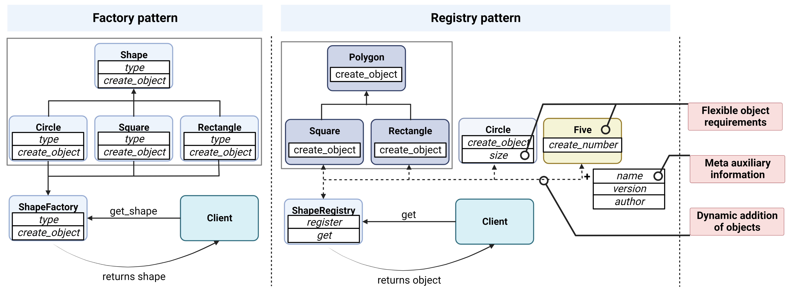
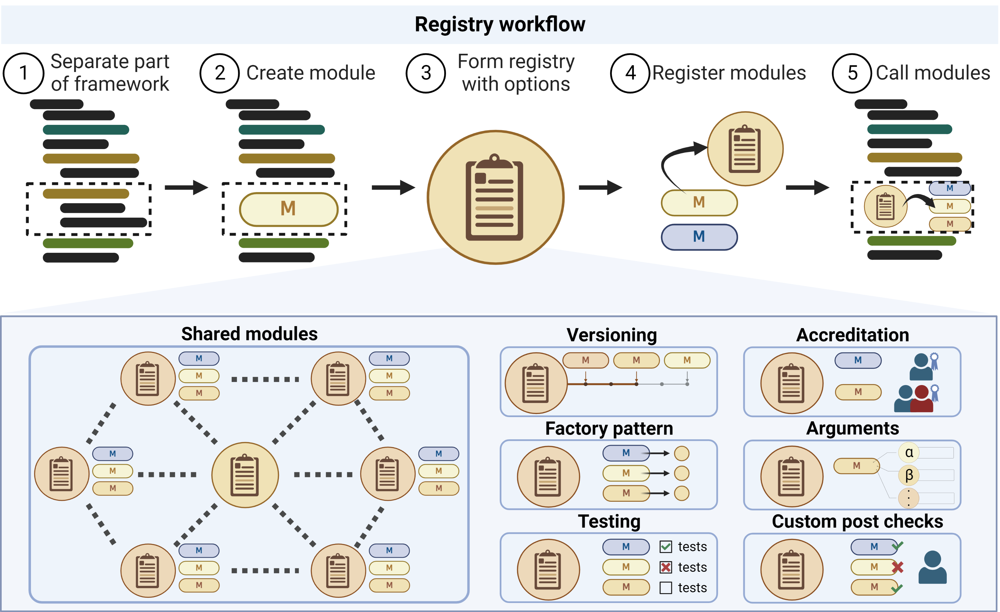

# RegistryFactory


[](https://colab.research.google.com/drive/1jlyEd1yxhvFCN82YqEFI82q2n0k_y06F?usp=sharing)

An abstract implementation of the software design pattern called registry proposed in (Hartog et. al., 2023),
providing a factory for creating registries to which categorically similar modules can be organized.

**Content:**
**[Installation](#installation)**
| **[Dependencies](#dependencies)**
| **[Usage](#usage)**
| **[Citation](#citation)**
| **[Code of Conduct](#code-of-conduct)**

### Overview

The registry design patterns provides a way to organize modular
functionalities dynamically and achieve a unified, reusable, and interchangeable interface.
It extends the Factory design pattern without the explicit class dependency.
Additionally, the registry supports optional meta information such as versioning, accreditation,
testing, etc.
The UML diagrams show the differences between the factory and registry patterns.

<p align="center">
  <br>
  
  <br>
<i>Created with BioRender.com</i>
 </p>

## Installation

The codebase can be installed from PyPI using `pip`, or your package manager of choice, with

```bash
$ pip install registry-factory
```

## Dependencies

No third-party dependencies are required to use the minimal functionality of the RegistryFactory.

## Usage

The workflow of creating a registry is the following. 1) Identify a part of the code that can be
separated from the rest. 2) Modularize the section to be independent of the rest of the code. 3)
Create a registry from the RegistryFactory. 4) Register any modules that provide similar
functionalities. 5) Call the optional module from the registry from the main workflow. See below.

<p align="center">
  <br>
  
  <br>
<i>Created with BioRender.com</i>
 </p>

Further available options and use-cases are described in the following sections.

### A basic registry

A simple registry is created as such.

```Python
from registry_factory.factory import Factory

class Registries(Factory):
    TestRegistry = Factory.create_registry(shared=False)
```

Next, any models can be added to the ModelRegistry as such.

```Python
import torch.nn as nn

@Registries.ModelRegistry.register(call_name="simple_model")
class SimpleModel(nn.Module):
    ...
```

### Shared modules

A registry can be created to store shared modules. Shared modules are modules that are used in multiple registries (e.g. a model and a module).

```Python
from registry_factory.factory import Factory

class Registries(Factory):
    ModelRegistry = Factory.create_registry(shared=True)
    ModuleRegistry = Factory.create_registry(shared=True)

@Registries.ModelRegistry.register(call_name="encoder")
class Encoder(nn.Module):
    ...

Registries.ModuleRegistry.get("encoder")
```

### Arguments

A registry can be created to store modules with arguments. The arguments can be set when registering a module.

```Python
from registry_factory.factory import Factory

class Registries(Factory):
    ModelRegistry = Factory.create_registry(shared=True)

@Registries.ModelRegistry.register_arguments(key="simple_model")
@dataclass
class SimpleModelArguments:
    input_size: int
    output_size: int
```

Only dataclasses can be used as arguments.

### Versioning and accreditation

Two examples of additional meta information that can be stored in a registry is module versioning
and accreditation regarding how and to who credit should be attributed the module.

Versioning can be used to keep track of changes in a module. The version can be set when registering a module.

```Python
from registry_factory.factory import Factory
from registry_factory.checks.versioning import Versioning

class Registries(Factory):
    ModelRegistry = Factory.create_registry(checks=[Versioning(forced=False)])

@Registries.ModelRegistry.register(call_name="simple_model", version="1.0.0")
class SimpleModel(nn.Module):
    ...

Registries.ModelRegistry.get("simple_model") # Error, version not specified.
Registries.ModelRegistry.get("simple_model", version="1.0.0") # Returns the module.
```

Accreditation can be used to keep track of how and to who credit should be attributed the module.
The accreditation can be set when registering a module.

```Python
from registry_factory.factory import Factory
from registry_factory.checks.accreditation import Accreditation

class Registries(Factory):
    ModelRegistry = Factory.create_registry(checks=[Accreditation(forced=False)])

@Registries.ModelRegistry.register(
    call_name="simple_model",
    author="Author name",
    credit_type="reference",
    additional_information="Reference published work in (link)."
)
class SimpleModel(nn.Module):
    ...

Registries.ModelRegistry.get("simple_model")  # Returns the module.
Registries.ModelRegistry.get_info("simple_model")  # Returns all meta information including the accreditation information.
```

The reason why accreditation can return an object without specification is because the accreditation does not have "key" information. In the versioning module, the version is the key information which is used to grab the module from the registry. Without specifying the version, the registry will not know which module to return. In the accreditation module, the author, credit type, and additional information are not key information. Without specifying the author, credit type, and additional information, the registry will still know which module to return.

### Testing and Factory Patterns

We also provide defining tests and post checks applied to all modules in a registry. Define test
or post checks as follows when creating the registry.

```Python
class Pattern:
    """Test pattern."""

    def __init__(self):
        pass

    def hello_world(self):
        """Hello world."""
        print("Hello world")

class Registries(Factory):
    ModelRegistry = Factory.create_registry(
        shared=False, checks=[FactoryPattern(factory_pattern=Pattern, forced=False)]
    )

# No error, the module passes the test.
@ModelRegistry.register(
    call_name="hello_world"
)
class HelloWorld(Pattern):
    pass

# No error, the module passes the test.
@ModelRegistry.register(
    call_name="hello_world2"
)
class HelloWorld:
    def __init__(self):
        pass

    def hello_world(self):
        """Hello world."""
        print("Hello world")

# Error, the module does not pass the test.
@ModelRegistry.register(
    call_name="hello_world2"
)
class HelloWorld:
    def __init__(self):
        pass

    def goodday_world(self):
        """Good day world."""
        print("Good day world")
```

The factory also supports adding a callable test module to the registry. The callable test module can be specified to be called when a module is registered. The callable test module can be used to test the module when it is registered. The callable test module can be specified as follows when creating the registry.

```Python
class CallableTestModule:
    """Module to test."""

    def __init__(self, key: str, obj: Any, **kwargs):
        self.name = obj
        self.assert_name()

    def assert_name(self):
        assert self.name == "test", "Name is not test"


class Registries(Factory):
    ModelRegistry = Factory.create_registry(
        shared=False, checks=[Testing(test_module=CallableTestModule, forced=True)]
    )

Registries.ModelRegistry.register_prebuilt(key="name_test", obj="test") # No error, the module passes the test.
```

## Citation

Our paper in which we propose the registry design pattern, on which this package is built, is currently
available as a preprint. If you make use of the design pattern or this package please cite our work accordingly.

!!!!!! ADD PAPER LINK !!!!!!

<!-- ```
@inproceedings{hartog2023registry,
    title={Registry: a design pattern to promote code reuse in machine learning-based drug discovery},
    author={Hartog, Peter and Svensson, Emma and Mervin, Lewis and Genheden, Samuel and Engkvist, Ola and Tetko, Igor},
    year={2023},
    note={Preprint}
}
``` -->

### Funding

The work behind this package has received funding from the European Union’s Horizon 2020
research and innovation programme under the Marie Skłodowska-Curie
Actions, grant agreement “Advanced machine learning for Innovative Drug
Discovery (AIDD)” No 956832”. [Homepage](https://ai-dd.eu/).


## Code of Conduct

Everyone interacting in the codebase, issue trackers, chat rooms, and mailing lists is expected to follow the
[PyPA Code of Conduct](https://www.pypa.io/en/latest/code-of-conduct/).
